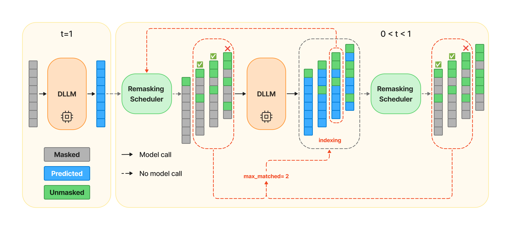

<div align="center">
<br>
<h3>Free Draft-and-Verification: Toward Lossless Parallel Decoding for Diffusion Large Language Models</h3>
<p align="center">
  <a href="https://arxiv.org/abs/2510.00294">
    
  </a>
</p>
</div>

## Updates
- **(09/23/2025) Current Supported Models**: [TraDo](https://github.com/Gen-Verse/dLLM-RL), [SDAR](https://github.com/JetAstra/SDAR), [Dream](https://github.com/DreamLM/Dream)

## Overview

We propose **FreeDave** (**Free** **D**raft-**a**nd-**Ve**rification), a fast sampling algorithm for diffusion language models, which achieves lossless parallel decoding via a pipeline of parallel-decoded candidate generation and verification, which is guaranteed to reproduce the same sequence generated by static sampling.

The generation and verification of the draft candidates can be understood as byproducts during the normal static sampling without introducing extra cost, except for a slight memory overhead from the batch forward. Empirically, with a high potential, the inference will get an appreciable speedup.

<p align="center">
  
</p>

## Quick Start
### Environment Setup
```bash
conda create --name freedave python=3.10
source activate freedave
pip install torch==2.6.0
pip install --no-cache-dir \
  https://github.com/Dao-AILab/flash-attention/releases/download/v2.7.4.post1/\
flash_attn-2.7.4.post1+cu12torch2.6cxx11abiFALSE-cp310-cp310-linux_x86_64.whl
pip install -r requirements.txt
```
### Chat Examples
We provide some examples of multi-turn chat for a quick start. 
```bash
python -m chat_examples.trado_chat_example
# python -m chat_examples.dream_chat_example
```

## Dataset Preparation

You can navigate to `./data` to download datasets for evaluation and training, for example as follows. In that directory, you will also find detailed instructions on how to modify your own dataset.

```bash
cd data
python download_data.py --dataset MATH500
python download_data.py --dataset GSM8K
python download_data.py --dataset AIME2024
cd ..
```

For the current version, only math reasoning benchmarks are supported. 


## Inference & Evaluations

After downloading the data, you are almost ready to evaluate diffusion language models. The next step is to select (or create) a config file in `./configs` that corresponds to your selected model. Take the [TraDo](https://github.com/Gen-Verse/dLLM-RL) models as an example. You can set the configurations in `configs/trado_eval.yaml` (see instructions and details in `./configs`) and run the following commands to perform inference with different sampling strategies.

```bash
python -m eval.trado_eval config=configs/trado_eval.yaml
# see details in ./configs
```

Use `configs/trado_eval.yaml` for TraDo, `configs/sdar_eval.yaml` for SDAR, and `configs/dream_eval.yaml` for Dream. A example script `run_exp.sh` is also provided for reference. 


There are two main sampling methods you can choose:

- **Static Sampling:** unmask fixed number of tokens each time
- **Dynamic Sampling:** unmask tokens based on a chosen threshold, faster than static

FreeDave is designed base on static sampling with greedy decoding, but also compatible with threshold-based dynamic sampling from our empirical results, which brought further speedup. Considering the non-negligible performance drop brought by dynamic sampling, we did not discuss too many details of this combination in our current version, but we still keep the support for that on TraDo models in case someone is interested in a try. For the Dream model, we just skipped the support for this combination.


## Citation

```
@article{wu2025free,
  title={Free Draft-and-Verification: Toward Lossless Parallel Decoding for Diffusion Large Language Models}, 
  author={Wu, Shutong and Zhang, Jiawei},
  journal={arXiv preprint arXiv:2510.00294},
  year={2025}
}
```

## Acknowledgement

This repository is heavily built on [TraDo](https://github.com/Gen-Verse/dLLM-RL), and we have also referenced the following open-source projects:
- [SDAR](https://github.com/JetAstra/SDAR)
- [Dream](https://github.com/DreamLM/Dream)
- [LLaDA](https://github.com/ML-GSAI/LLaDA)

and theoretical foundations:
- [MDLM](https://arxiv.org/pdf/2406.07524)
- [DiffuLLaMA](https://arxiv.org/abs/2410.17891)
- [Block Diffusion](https://arxiv.org/abs/2503.09573)
