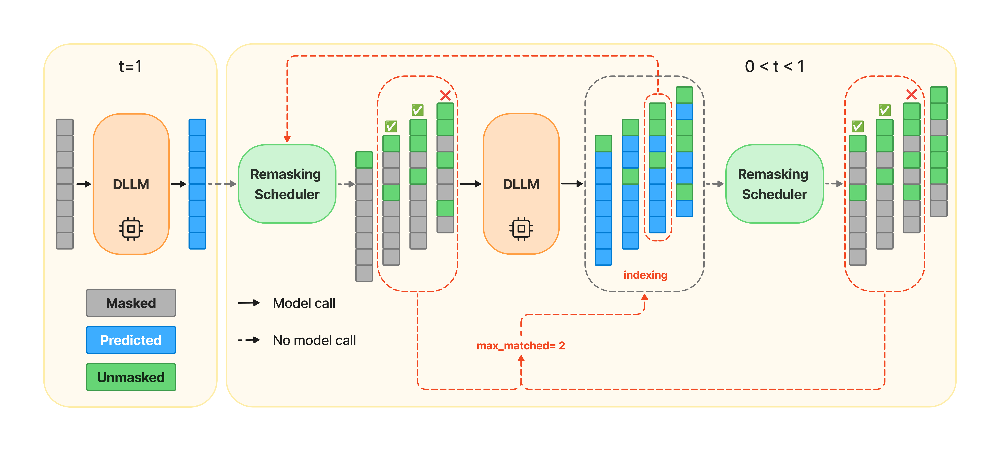

<div align="center">
<br>
<h3>Free Draft-and-Verification: Toward Lossless Parallel Decoding for Diffusion Large Language Models</h3>
<p align="center">
  <a href="https://arxiv.org/abs/2510.00294">
    
  </a>
</p>
</div>

## Updates
#### **(04/13/2026) New Features**: 
  - More standardized evaluation pipeline under [lm-evaluation-harness](https://github.com/EleutherAI/lm-evaluation-harness). The old customized evaluation pipeline following [Trace-RL](https://github.com/Gen-Verse/dLLM-RL) is currently deprecated. 
  - Two draft modes for FreeDave: 
    - `batch_expanding`: copy both cache and current block along the batch dimension; more memory overhead, compatible with flash-attn.
    - `tree_attention`: copy only current block along the sequence dimension and share cache using a block tree attention mask; much less memory overhead (usually ~10MB), incompatible with flash-attn due to the customized attention mask. 
    - From our observation, although incompatible with flash-attn, tree_attention mode without frequent cache copy and reduction operations is usually a bit faster than batch_expanding mode. We also add [flex attention](https://pytorch.org/blog/flexattention/) for supported models, such that tree_attention mode can also enjoy high-performance kernels.  
  - Confidence-aware parallel decoding
    - Previsouly, we followed [Trace-RL](https://github.com/Gen-Verse/dLLM-RL) and used the same configuration as them. Specifically, they **use a temperature of 0.1** for confidence-aware parallel decoding, and under this setting the confidence-aware parallel decoding is not robust, ususally bringing a significant performance drop. 
    - We currently **set the temperature to 0** for confidence-aware parallel decoding by default. Under this configuration, confidence-aware parallel decoding is more stable and closer to the results reported in [Fast-dLLM](https://github.com/NVlabs/Fast-dLLM).
    - Additionally, FreeDave can currently build on confidence-aware parallel decoding as well, using a subset-based verification rule. With the appropriate temperature, confidence-aware FreeDave can further boost the inference efficiency while maintaining the generation quality.
  - Add support for [LLaDA](https://github.com/ML-GSAI/LLaDA)
    - The `modeling_llada.py` file on huggingface is not directly compatible with the cache implementation under our generation pipeline. We made some modifications.
#### **(09/23/2025) Current Supported Models**: [TraDo](https://github.com/Gen-Verse/dLLM-RL), [SDAR](https://github.com/JetAstra/SDAR), [Dream](https://github.com/DreamLM/Dream)

## Overview

We propose **FreeDave** (**Free** **D**raft-**a**nd-**Ve**rification), a training-free and model-free fast decoding algorithm for diffusion language models, which achieves lossless parallel decoding with a theoretical guarantte to reproduce the same sequence generated by one-token-per-step decoding. 

Specifically, FreeDave utlizes a pipeline of parallel-decoded candidate generation and verification, where the parallel decoded draft tokens at the current step can be verifed by the model itself at the next step without extra model forward or external modules. 

The generation and verification of the draft candidates can be understood as byproducts during the one-token-per-step decoding without introducing extra cost, except for a slight memory overhead from the batch forward. Empirically, with a high potential, the inference will get an appreciable speedup while still maintaining the generation quality. 

<p align="center">
  
</p>

## Repo Structure

```text
FreeDave-V2/
├── chat/                   # Chat demos
│   ├── full_attn_dlm.py     # Full-attention DLMs (Dream/LLaDA)
│   └── block_attn_dlm.py    # Block-attention DLMs (TraDo/SDAR)
├── generation/             # Core generation module
│   ├── core.py              # Core decoding algorithms implementation
│   ├── attn_utils.py        # Attention mask utilities
│   ├── cache_utils.py       # KV cache utilities
│   ├── monitor_utils.py     # Model forward monitor + debug utilities
│   └── sampling_utils.py    # Sampling utilities
└── eval/                   # evaluation under lm_eval framework
    ├── README.md
    ├── eval_dream.py        # Dream wrapper with inference stats integrated
    ├── eval_llada.py        # LLaDA wrapper with inference stats integrated
    ├── eval_trado.py        # TraDo/SDAR wrapper with inference stats integrated
    ├── scripts/             # eval scripts
    └── tasks/               # Customized lm-eval tasks
```

## Quick Start
### Environment Setup
```bash
conda create --name freedave python=3.10
source activate freedave
pip install torch==2.6.0
pip install --no-cache-dir \
  https://github.com/Dao-AILab/flash-attention/releases/download/v2.7.4.post1/\
flash_attn-2.7.4.post1+cu12torch2.6cxx11abiFALSE-cp310-cp310-linux_x86_64.whl
pip install -r requirements.txt
```
### Chat Examples
We provide some examples of multi-turn chat for a quick start. 
- For full-attention models like [LLaDA](https://github.com/ML-GSAI/LLaDA) and [Dream](https://github.com/DreamLM/Dream):
```bash
python -m chat.full_attn_dlm --model_name <hf_model_path>
```

- For block-attention models like [TraDo](https://github.com/Gen-Verse/dLLM-RL) and [SDAR](https://github.com/JetAstra/SDAR),:
```bash
python -m chat.block_attn_dlm --model_name <hf_model_path>
```


## Inference & Evaluations

Please see [`eval/README.md`](eval/README.md) for more details. We have built a more standardized evaluation pipeline under [lm-evaluation-harness](https://github.com/EleutherAI/lm-evaluation-harness). The old customized evaluation pipeline following [Trace-RL](https://github.com/Gen-Verse/dLLM-RL) is currently deprecated. 

<!-- There are two main sampling methods you can choose:
- **Static Sampling:** unmask fixed number of tokens each time
- **Dynamic Sampling:** unmask tokens based on a chosen threshold, faster than static
FreeDave is designed base on static sampling with greedy decoding, but also compatible with threshold-based dynamic sampling from our empirical results, which brought further speedup. Considering the non-negligible performance drop brought by dynamic sampling, we did not discuss too many details of this combination in our current version, but we still keep the support for that on TraDo models in case someone is interested in a try. For the Dream model, we just skipped the support for this combination. -->


## Citation

```
@article{wu2025free,
  title={Free Draft-and-Verification: Toward Lossless Parallel Decoding for Diffusion Large Language Models}, 
  author={Wu, Shutong Zhang, Jiawei},
  journal={arXiv preprint arXiv:2510.00294},
  year={2025}
}
```

## Acknowledgement

This repository is heavily built on [Trace-RL](https://github.com/Gen-Verse/dLLM-RL), and we have also referenced the following open-source projects:
- [SDAR](https://github.com/JetAstra/SDAR)
- [Dream](https://github.com/DreamLM/Dream)
- [LLaDA](https://github.com/ML-GSAI/LLaDA)
- [Fast-dLLM](https://github.com/NVlabs/Fast-dLLM)

and theoretical foundations:
- [MDLM](https://arxiv.org/pdf/2406.07524)
- [DiffuLLaMA](https://arxiv.org/abs/2410.17891)
- [Block Diffusion](https://arxiv.org/abs/2503.09573)